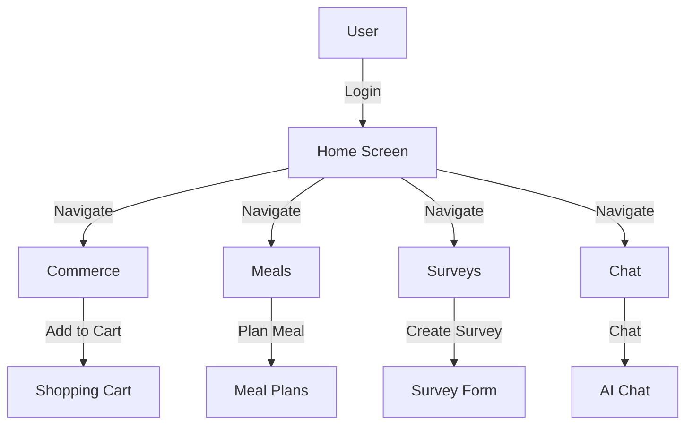
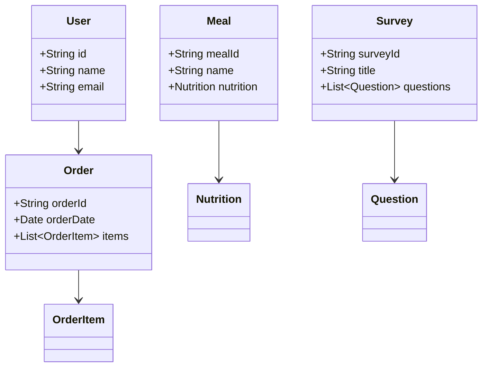

# Firefit

Firefit is a comprehensive Flutter application designed to provide a seamless experience for managing various aspects of commerce, meals, surveys, and more. This project leverages a modular architecture to ensure scalability and maintainability.

## Project Overview

Firefit is a multi-feature application that includes functionalities such as:
- Commerce management with shopping cart and order tracking.
- Meal planning and nutrition tracking.
- Survey creation and management.
- Chat functionalities with AI assistance.

## Architecture

The application follows a feature-based architecture, with each feature encapsulated within its own module. This approach promotes separation of concerns and makes the codebase easier to navigate and maintain.

### Key Features

- **Commerce**: Includes screens and providers for managing shopping carts, orders, and provider searches.
- **Meals**: Provides tools for meal planning, nutrition tracking, and AI-assisted meal searches.
- **Surveys**: Allows users to create and manage surveys with dynamic form rendering.
- **Chat**: Features AI-assisted chat functionalities and a robust chat database.

### Core Technologies

- **Flutter**: The primary framework for building the application.
- **Riverpod**: Used for state management across the application.
- **Supabase**: Provides backend services for authentication and data management.
- **Dio**: A powerful HTTP client for making network requests.

## Directory Structure

The project is organized into several key directories, each serving a specific purpose:

- **lib/**: Contains the main application code, organized by features such as commerce, meals, surveys, and chat.
  - **config/**: Configuration files and settings.
  - **core/**: Core functionalities and shared components.
  - **features/**: Feature-specific code, further divided into subdirectories for each feature.
  - **theme/**: Theme-related files, including styles and theming utilities.
  - **utils/**: Utility functions and helpers.

- **packages/**: Houses the `core` package, which contains shared logic and models used across the application.

- **assets/**: Static assets such as images and fonts.

- **web/**: Web-specific files for the Flutter web application.

- **android/** and **ios/**: Platform-specific files for Android and iOS builds.

## CLEAN Architecture

The application follows the principles of CLEAN architecture, ensuring a clear separation of concerns and promoting maintainability. The architecture is structured as follows:

- **Presentation Layer**: Handles the UI and user interactions, located in the `features` directory.
- **Domain Layer**: Contains business logic and domain models, primarily found in the `core` package.
- **Data Layer**: Manages data sources and repositories, also within the `core` package.

## Monorepo Setup

This project is structured as a monorepo, with the `packages/core` package serving as a central hub for shared logic and models. This setup allows for efficient code reuse and modular development.

## GraphQL Management

GraphQL is used for data management, with queries and mutations defined in the `packages/core/lib/*/graphql` directories. This approach provides a flexible and efficient way to interact with backend services.

## Code Generation

The project utilizes code generation to streamline development and ensure type safety. This includes generating models and services based on GraphQL schemas and other specifications.

## Features

The application includes a variety of features, each encapsulated within its own module:

- **Commerce**: Manages shopping carts, orders, and provider searches.
- **Meals**: Offers meal planning, nutrition tracking, and AI-assisted meal searches.
- **Surveys**: Enables survey creation and management with dynamic form rendering.
- **Chat**: Provides AI-assisted chat functionalities and a robust chat database.

## Application Flow



## Data Model and Object Model



## Setup Instructions

To set up the development environment and run the application, follow these steps:

1. **Clone the Repository**: 
   ```bash
   git clone <repository-url>
   cd firefit
   ```

2. **Install Flutter**: Ensure you have Flutter installed. Follow the [official Flutter installation guide](https://flutter.dev/docs/get-started/install) if needed.

3. **Install Dependencies**:
   ```bash
   flutter pub get
   ```

4. **Run the Application**:
   ```bash
   flutter run
   ```

## Maintenance Guidelines

- **Updating Dependencies**: Regularly check for updates to the dependencies listed in `pubspec.yaml` and update them using:
  ```bash
  flutter pub upgrade
  ```

- **Code Quality**: Use `flutter analyze` to ensure code quality and adherence to best practices.

- **Testing**: Write and run tests using the Flutter testing framework to maintain code reliability.

- **Documentation**: Keep the code well-documented and update this `README.md` as the project evolves.

By following these guidelines, you can ensure that the Firefit application remains robust and easy to maintain.
