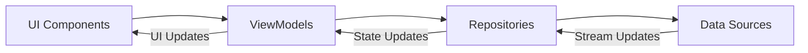

# FireFit Architecture Documentation

## Current Architecture Overview

### Clean Architecture Layers
1. **Domain Layer**:
   - Contains business logic and interfaces
   - Defines core entities and use cases
   - Example: `ProductRepositoryInterface`

2. **Infrastructure Layer**:
   - Implements domain interfaces
   - Handles data sources (GraphQL, Supabase, local DB)
   - Example: `ProductRepository`

3. **Presentation Layer**:
   - UI components and state management
   - Uses Riverpod with AsyncNotifier
   - Follows MVVM pattern with ViewModels

### State Management
- Uses Riverpod with AsyncNotifier for state
- ViewModels encapsulate UI state and logic
- Stream subscriptions for real-time updates
- Isolates for performance-intensive operations

### Data Flow


## Recommendations

### 1. Stream Optimization for High-Frequency Updates
**Current Implementation**:
- Uses Supabase real-time subscriptions
- Streams integrated with AsyncNotifiers

**Improvements**:
```dart
// Add debouncing to high-frequency streams
stream.debounceTime(Duration(milliseconds: 300))
```

**Guidelines**:
- Use `StreamBuilder` for UI that needs real-time updates
- Consider `ValueNotifier` for simpler state that doesn't need streams
- Document stream lifecycle management

### 2. AsyncNotifier as ViewModel Pattern
**Current Implementation**:
- Follows MVVM pattern
- ViewModels manage UI state and business logic

**Standardization Recommendations**:
1. Naming convention: `[Feature]ViewModel`
2. Standard state properties:
   - `isLoading`
   - `error`
   - `data`
3. Common methods:
   - `load()`
   - `refresh()`
   - `onError()`

### 3. Race Condition Prevention
**Current Strategies**:
- Isolates for database operations
- AsyncNotifier state management

**Additional Recommendations**:
```dart
// Use transactions for critical operations
await database.transaction(() async {
  // Multiple operations
});
```

**Optimistic Updates**:
```dart
// Example optimistic update pattern
final previousState = state;
try {
  state = newState;
  await repository.update(data);
} catch (e) {
  state = previousState;
}
```

### 4. Offline-First Strategies
**Current Implementation**:
- Local database as cache
- Basic synchronization

**Improvements**:
1. Conflict Resolution:
   - Timestamp-based resolution
   - User preference options

2. Operation Queue:
```dart
class OfflineQueue {
  final List<QueuedOperation> _queue = [];
  
  void addOperation(QueuedOperation op) {
    _queue.add(op);
    _processQueue();
  }
  
  Future<void> _processQueue() async {
    while (_queue.isNotEmpty && hasNetwork) {
      await _queue.removeLast().execute();
    }
  }
}
```

3. Cache Invalidation:
   - Time-based expiration
   - Version-based invalidation

## Implementation Guidelines

### Stream Best Practices
1. Always cancel subscriptions in `onDispose`
2. Use `asyncMap` for async operations in streams
3. Handle errors with `onError` callbacks

### ViewModel Composition
```dart
class ProductViewModel extends AsyncNotifier<ProductState> {
  @override
  Future<ProductState> build() async {
    // Initial load logic
  }
  
  Future<void> refresh() async {
    state = const AsyncLoading();
    state = await AsyncValue.guard(() async {
      return _repository.getProducts();
    });
  }
}
```

### Performance Optimization
1. Use `compute()` for CPU-intensive tasks
2. Implement pagination for large datasets
3. Consider `Stream.memoize()` for shared streams

### Testing Strategies
1. Mock repositories for unit tests
2. Widget tests for UI components
3. Integration tests for full flows

## Future Considerations
1. GraphQL subscriptions as alternative to Supabase
2. BLoC pattern for complex state
3. App-wide error handling system