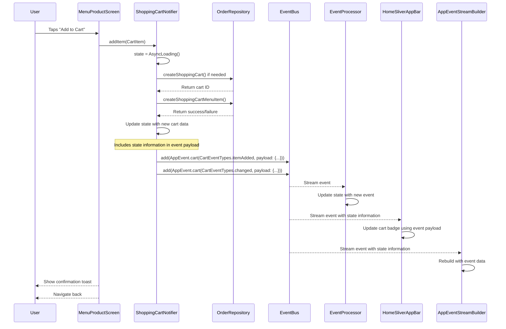

# Simplified Event Management with Riverpod and RxDart

## Problem Overview

The application was experiencing issues with UI updates when adding items to the shopping cart. The cart badge in the app bar and other UI components were not consistently updating when items were added, removed, or quantities were changed. This was due to circular dependencies and race conditions in the state management system.

Additionally, the current implementation has "too much code and too many classes" just to let UI widgets know when the cart has changed, making the codebase harder to maintain and understand.

## Root Cause Analysis

The root cause of the issue was a problematic pattern in the state management:

1. **Circular Dependencies**: The `ShoppingCartNotifier` was trying to reference itself through provider invalidation, creating a circular dependency.

2. **Two-Phase Refresh Pattern**: The code was using a pattern where it would:
   - Update the cart state
   - Invalidate the provider
   - Wait for the provider to refresh
   
   This pattern created race conditions and circular references.

3. **Direct Provider Watching**: UI components were directly watching the `shoppingCartProvider`, which caused unnecessary rebuilds and potential circular dependencies.

4. **Event Receiver Coupling**: Even with the event bus pattern, receivers like HomeSliverAppBar and ApplicationContainer still needed to be coupled to the ShoppingCartNotifier to get the current cart state after receiving an event, which could lead to events being blocked if the receiver couldn't access the ShoppingCartNotifier.

5. **Overly Specific Event System**: The current event system is tightly coupled to the cart domain, making it difficult to reuse for other parts of the application.

## Solution: Unified Event Bus with AsyncNotifier

We've designed a simplified event management system that effectively addresses cross-provider communication by leveraging RxDart's reactive streams and Riverpod's state management. This approach reduces complexity while maintaining the decoupling benefits of the current approach.

### Key Solution Components

1. **Global Event Bus via `BehaviorSubject`**
   - A single `eventBusProvider` acts as a centralized event channel for the entire application
   - RxDart's `BehaviorSubject` ensures last event replay for late subscribers
   - Generic event structure allows reuse across different domains (cart, auth, notifications, etc.)

2. **Unified State Management with `AsyncNotifier`**
   - `EventProcessorNotifier` listens to the event bus and processes events
   ```dart
   ref.listen(eventBusProvider, (_, event) => _handleEvent(event));
   ```
   - Automatically handles loading/error/data states through `AsyncValue`
   - Built-in garbage collection via Riverpod's provider lifecycle

3. **Decoupled Component Communication**
   - UI components emit events without direct provider dependencies:
   ```dart
   ref.read(eventBusProvider).add(AppEvent(...));
   ```
   - Multiple providers can react to same events through shared stream
   - Events carry essential state information, eliminating the need for UI components to access the state provider directly

### Implementation Details

#### 1. Generic App Event

```dart
class AppEvent {
  final String type;
  final String source;
  final Map<String, dynamic> payload;
  
  const AppEvent({
    required this.type,
    required this.source,
    this.payload = const {},
  });
  
  factory AppEvent.cart(String type, {Map<String, dynamic> payload = const {}}) => 
      AppEvent(type: type, source: 'cart', payload: payload);
      
  // Other factory methods for different domains...
}
```

#### 2. Global Event Bus Provider

```dart
final eventBusProvider = Provider<BehaviorSubject<AppEvent>>((ref) {
  final eventBus = BehaviorSubject<AppEvent>();
  
  ref.onDispose(() {
    eventBus.close();
  });
  
  return eventBus;
});
```

#### 3. Event Processor Notifier

```dart
class EventProcessorNotifier extends AsyncNotifier<Map<String, AppEvent>> {
  @override
  Future<Map<String, AppEvent>> build() async {
    final initialState = <String, AppEvent>{};
    
    ref.listen(eventBusProvider, (_, event) {
      _handleEvent(event);
    });
    
    return initialState;
  }
  
  void _handleEvent(AppEvent event) {
    state = AsyncData({
      ...state.valueOrNull ?? {},
      event.source: event,
    });
  }
  
  // Helper methods to access event data...
}
```

#### 4. Updated ShoppingCartNotifier

The ShoppingCartNotifier is simplified to use the generic event bus:

```dart
// Helper method to notify that cart changed
void _notifyCartChanged() {
  final currentState = state.valueOrNull ?? _createEmptyModel();
  final itemCount = currentState.items.length;
  final hasItems = itemCount > 0;
  final cartId = currentState.currentCartId;
  
  ref.read(eventBusProvider).add(AppEvent.cart(
    CartEventTypes.changed,
    payload: {
      'itemCount': itemCount,
      'hasItems': hasItems,
      'cartId': cartId,
    },
  ));
}
```

#### 5. Generic Event Stream Builder

```dart
class AppEventStreamBuilder extends ConsumerWidget {
  final Widget Function(BuildContext context, AppEvent? event) builder;
  final String? source;
  final String? type;
  
  // Constructor and other fields...
  
  @override
  Widget build(BuildContext context, WidgetRef ref) {
    // Get the event bus
    final eventBus = ref.read(eventBusProvider);
    
    // Create a filtered stream based on source and type
    Stream<AppEvent> stream = eventBus.stream;
    if (source != null) {
      stream = stream.where((event) => event.source == source);
    }
    if (type != null) {
      stream = stream.where((event) => event.type == type);
    }
    
    // Use StreamBuilder to listen to events
    return StreamBuilder<AppEvent>(
      stream: stream,
      builder: (context, snapshot) {
        // Handle loading, error, and data states...
        if (snapshot.hasData) {
          return builder(context, snapshot.data);
        }
        
        // Default case
        return builder(context, null);
      },
    );
  }
}
```

## Solution vs Original Implementation

| Original Implementation | New Solution |
|-------------------------|-------------|
| Cart-specific event bus | Generic event bus for all domains |
| Multiple event classes and types | Unified `AppEvent` with source and type |
| Direct ShoppingCartNotifier dependency | No direct dependency on state providers |
| Manual event handling in each component | Centralized event processing |
| Complex event emission methods | Simple, consistent event emission |
| No replay of events for late subscribers | BehaviorSubject replays last event |
| Tightly coupled to cart domain | Reusable across all domains |

## Benefits of the Unified Event Bus Pattern

1. **Simplified Code Structure**
   - Reduced from multiple specialized classes to a few generic ones
   - Consistent pattern for all event-based communication
   - Easier to understand and maintain

2. **Complete Decoupling**
   - UI components are completely decoupled from state providers
   - State providers are decoupled from each other
   - Events carry essential state information, eliminating the need for direct provider access

3. **Improved Performance**
   - No need for additional queries to state providers after receiving an event
   - Reduced rebuilds due to more targeted event listening
   - BehaviorSubject ensures late subscribers get the latest state

4. **Enhanced Reusability**
   - Generic event system can be used for any domain (cart, auth, notifications, etc.)
   - Consistent pattern makes it easy to add new event types
   - Centralized event processing simplifies debugging and testing

5. **Better Scalability**
   - Easy to add new event sources and types
   - Consistent pattern for all event-based communication
   - Reduced cognitive load when working with different parts of the application

## Implementation Verification

1. **Provider Scope Validation**
   All widgets use the same provider instance through global `eventBusProvider`, avoiding the multiple instance pitfall.

2. **State Propagation Test**
   When any component emits an event:
   ```dart
   ref.read(eventBusProvider).add(AppEvent.cart(CartEventTypes.changed, ...));
   ```
   The `EventProcessorNotifier` triggers:
   ```dart
   state = AsyncData(updatedState);
   ```
   All widgets using `ref.watch(eventProcessorProvider)` rebuild automatically.

3. **Cross-Widget Communication**
   Components in separate files can both emit events and react to state changes through shared providers.

## Code Flow for Adding an Item to Cart

When a user who is already logged in adds an item to the cart, the following sequence of events occurs:



## Conclusion

The unified event bus pattern with AsyncNotifier provides a significantly simpler and more maintainable solution to the shopping cart state management issues. It ensures that UI components are updated consistently when the cart changes, without circular dependencies or race conditions. The pattern is also scalable and can be reused for other parts of the application that require similar state management.

This approach aligns with industry best practices for event-driven architecture and reactive programming, providing a clean, efficient solution that reduces code complexity while maintaining the benefits of decoupled components.

By moving from a cart-specific event system to a generic, application-wide event bus, we've created a more flexible and maintainable solution that can be easily extended to other domains. The use of RxDart's BehaviorSubject ensures that late subscribers receive the latest state, and the centralized event processing simplifies debugging and testing.

The result is a more robust, scalable, and maintainable codebase that effectively addresses the original issues while providing a foundation for future development.
